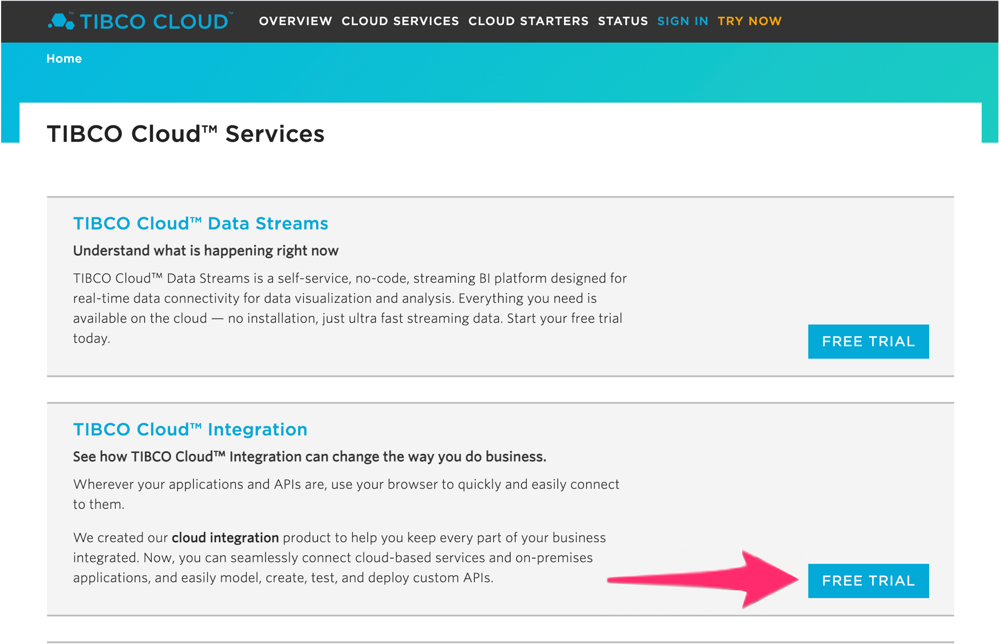
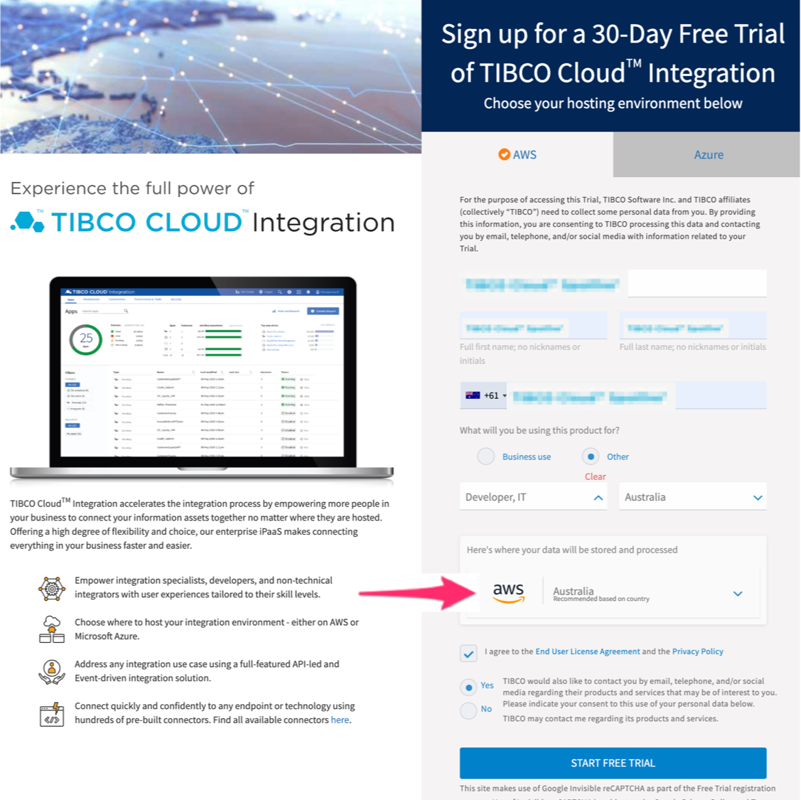
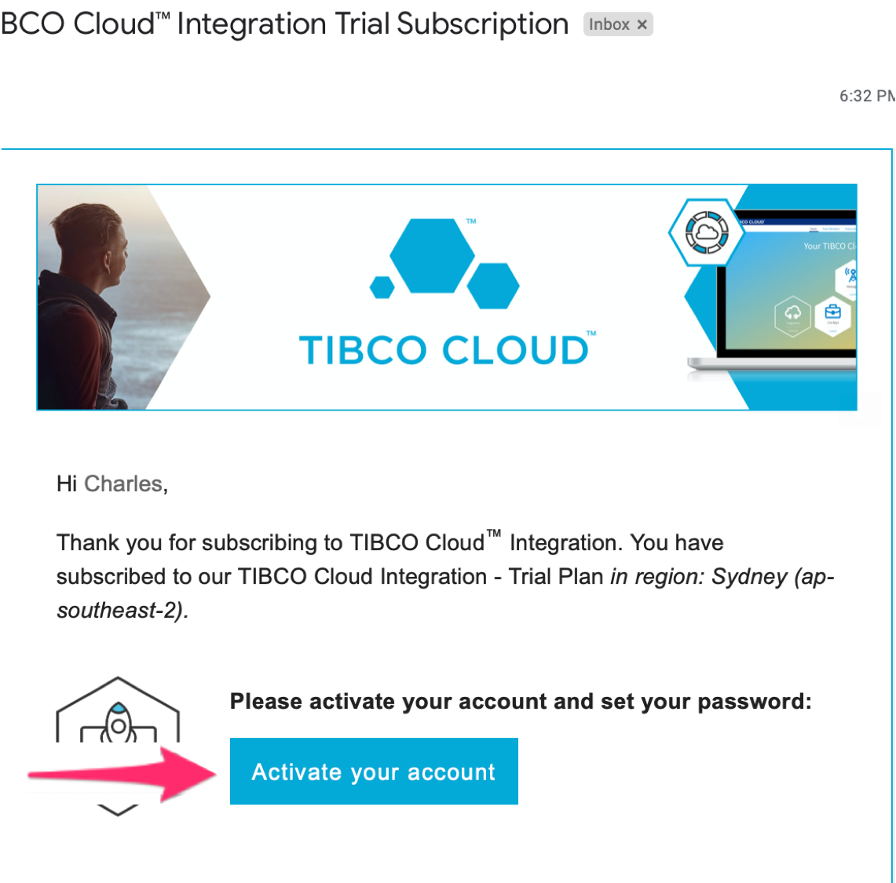
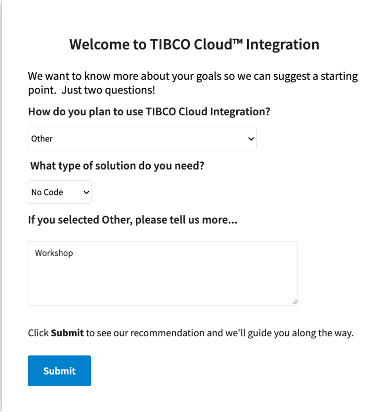
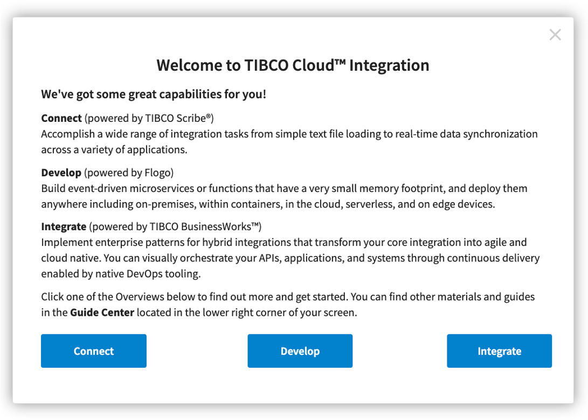
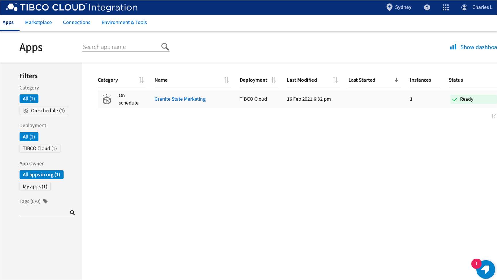
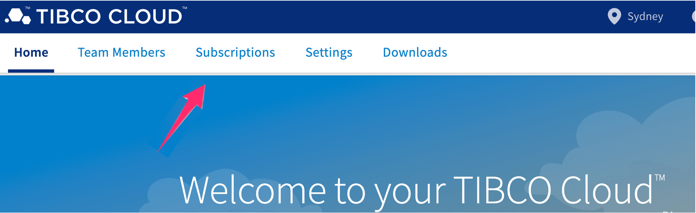
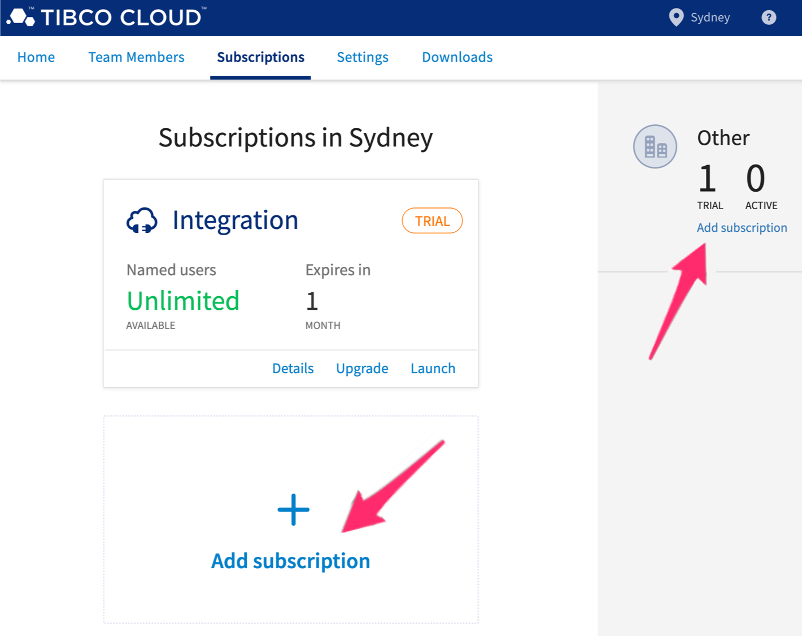
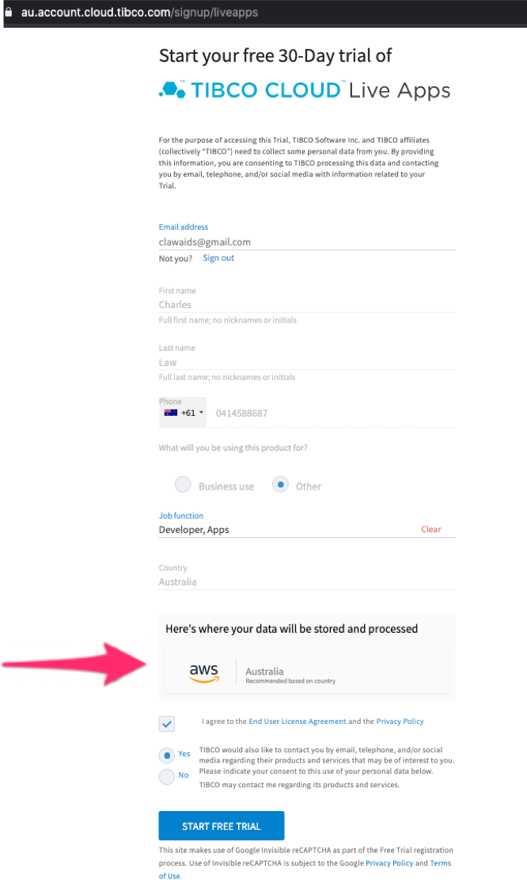

# Getting Started with TIBCO Cloud

The workshop requires a TIBCO Cloud account. Within that Cloud account, you'll signup to use **TIBCO Cloud Integration** and **TIBCO Live Apps**

The following instructions walk you through getting your environment all setup.
In a new tab, follow this URL, [https://cloud.tibco.com/cloud-services](https://cloud.tibco.com/cloud-services).  

**If you are a TIBCO customer or employee, please use your personal email to sign up for the free trial and send us your personal email.**

## TIBCO Cloud Integration Subscription
In **TIBCO Cloud Integration**, select **FREE TRIAL**.

In the Trial Sign Up form, select **AWS** as the hosting environment. Enter your details and be sure to enter a valid email address. 
Make sure the AWS instance is hosted in **Australia** (which is the default instance for most countries in Asia Pacific region) to start your free trial.

In about 30 seconds your cloud environment will be ready.  You'll receive an email to verify, activate, and set the password on your account.

In the **Trial Subscription Email**, 
Select **Activate your account** 
(Note: If your default web browser is not Chrome, right-click against the **Activate your account** button and copy the link. Open Chrome and paste the link to the web address) 

In the **TIBCO Cloud Activate Your Account** page, enter email address and password to login

Fill in the details of the **Welcome Form** 

Close the **Welcome to TCI Capabilities Form** 

You are setup with **TIBCO Cloud Integration**

## TIBCO Cloud Live Apps Subscription
Next, Sign up for **Live Apps Subscription**,
Click the TIBCO Cloud link (above the menu items) at the top left area to navigate to the TIBCO Cloud landing page.
To add the additional capability, click on **Subscriptions**.

Click on the **Add Subscription** links.  Either link will work just fine.

Add Live Apps subscription to your trial by clicking on the **Free trial** button.

Enter your details and ensure it is at AWS Australia instance

That's it! 
You're ready for the workshop.

Next step: [Go Back to where you left off at the Introduction Page 'here' ](README.md#workshop-overview)
